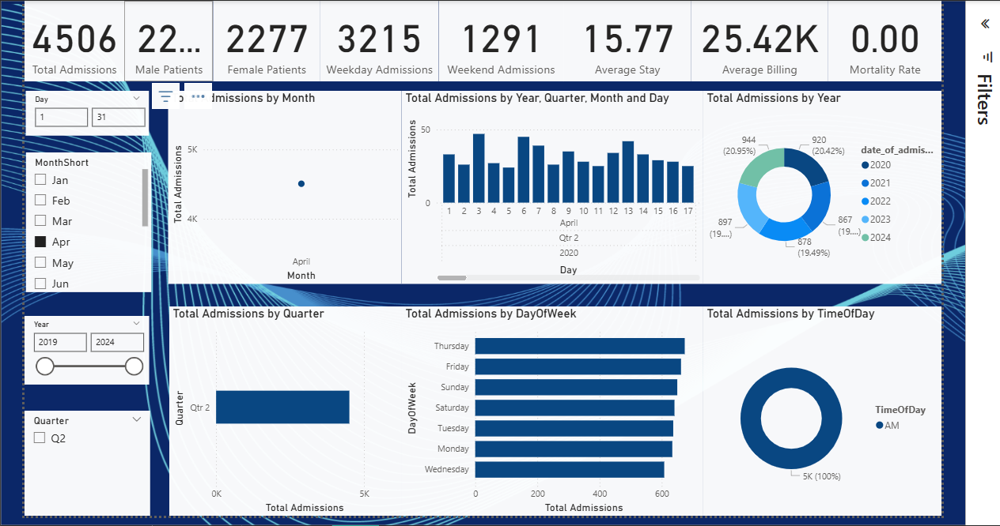
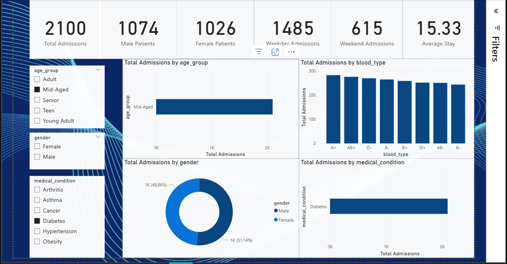

# 🏥 Healthcare Analytics Dashboard (Power BI)

This project analyzes **healthcare data** using **Power BI** to provide actionable insights into **patient demographics, admissions, hospital performance, billing, and satisfaction trends**.  

The dashboard is designed to help **hospital administrators, healthcare analysts, and policymakers** make data-driven decisions for improving patient care and operational efficiency.  

---

## 📂 Files in this Repository
- `Healthcare_ANALYTICS.pbix` → Power BI dashboard file  
- `cleaned_healthcare_dataset.csv` → Preprocessed dataset used in the dashboard  

---

## 🎯 Objectives
- Track **admissions trends** (daily, monthly, yearly, quarterly)  
- Analyze **demographics** (age, gender, admission type)  
- Monitor **average stay length & billing amount**  
- Compare **weekday vs weekend admissions**  
- Evaluate **mortality**  

---
## 📊 Dashboard Preview

Here are some snapshots of my Power BI dashboard 👇

---

## 📊 Dashboard Pages

### 🔹 Page 1: Overview
- Total admissions (KPI)  
- Admissions trends over time (daily, monthly, yearly, quarterly)  
- Top diseases by admissions  
- Patients by age group & gender distribution  
- Mortality rate & average billing KPIs  

---

### 🔹 Page 2: Patient Demographics & Experience
- Total male vs female patients (KPI)  
- Weekday vs weekend admissions (KPI)  
- Age group distribution (bar chart)  
- Gender distribution (donut chart)    
- Medical condition breakdown

---

## ⚙️ Tools & Technologies
- **Power BI** → Data visualization & dashboard design  
- **Python (Pandas, Matplotlib)** → Data cleaning & preprocessing  
- **GitHub** → Version control & project hosting
 
---

###  Contributing
Feel free to raise issues or suggest improvements!

